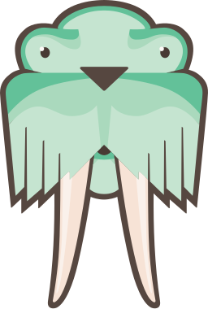

### Hi there 👋

### I'm Junaid Khalid 👨‍💻💻💻 Software Developer .🇵🇰

 

##### Life of a Programmer in Simple Jokes That Will Make You Laugh but, passionate about new technologies 😃

- 👨‍💻 I am currently working on Javascript & React
- 🌱 I am currently learning Mongodb
- 💫 Looking to contribute to open-source

<!-- <h4 align="center"> 
  Visitor count 
  
</h4> -->
<!-- 
%20-%23<badge-color>.svg?&style=for-the-badge&logo=<badge>&logoColor=<logo-color>"/> -->

<!-- 
 -->

####  🔥 Tech Stacks :
 

##### ⚡️ Fronted :

 

##### ⚡️ Backend :

 

##### ⚡️ Other's Backend :

 

##### 🌟 Learning :

 

#### 🤝 Connect with me:

 

#### 📊 Stats :

